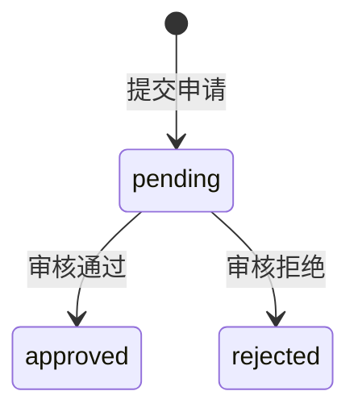
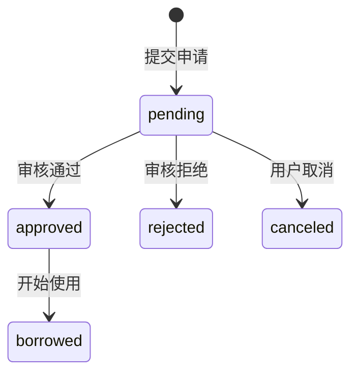

# 系统接口文档

## 1. 用户认证模块
### 登录接口
- **URL**: POST /api/auth/login
- **请求参数**:
+ 响应成功 (200):
    {
    "token": "JWT令牌",
    "userInfo": {
    "userId": 1,
    "username": "string",
    "role": "admin/teacher/student"
    }
    }
- 错误响应:
  + 401: 用户名或密码错误
  + 500: 系统内部错误
## 2. 图书管理模块
### 查询图书列表
- **URL**: GET /api/book
- **请求参数**:
   + page=1 (当前页码)
   + pageSize=20 (每页数量)
   + categoryId=1 (可选，分类过滤)
   + keyword=搜索词 (可选，模糊搜索)
- 响应成功 (200):
  {
  "page": 1,
  "pageSize": 20,
  "total": 100,
  "hasNext": true,
  "data": [
  {
  "bookId": 1,
  "isbn": "9781234567890",
  "title": "图书标题",
  "author": "作者",
  "publisher": "出版社",
  "publishYear": 2023,
  "categoryId": 1,
  "totalCount": 10,
  "borrowedCount": 3,
  "location": "馆藏位置"
  }
  ]
  }
###  新增图书
- **URL**: POST /api/book
- **请求参数**:
  {
  "isbn": "string (13位)",
  "title": "string",
  "author": "string",
  "publisher": "string",
  "publishYear": 2023,
  "categoryId": 1,
  "totalCount": 10,
  "location": "string"
  }
+ 响应成功 (201): 返回创建成功的图书ID
  + 错误响应:
  + 400: ISBN号必须为13位数字
  + 403: 无权限（仅管理员/教师）
## 3. 借阅管理模块
###   提交借阅申请
- **URL**: POST /api/borrow
- **请求参数**:
  {
  "bookId": 1,
  "userId": 1,
  "expectedReturnDate": "2023-12-31T00:00:00"
  }
- 响应成功 (201): 返回借阅记录ID
  状态流转:

### 审核借阅申请
- **URL**: PUT /api/borrow/{recordId}/approve
- **请求参数**:
    {
    "approve": true,
    "rejectReason": "拒绝理由（可选）"
    } 
+ 响应成功 (200): 操作成功
+ 权限要求: 管理员/教师
## 4. 服务器资源管理
###   查询资源列表
- **URL**: GET /api/resource
- **请求参数**:
+ categoryId=1 (可选，分类过滤)
+ availableOnly=true (可选，仅可用资源)
+ 响应成功 (200):
    {
    "data": [
    {
    "resourceId": 1,
    "name": "服务器名称",
    "description": "描述信息",
    "cpuCapacity": 16.0,
    "memoryCapacity": 64.0,
    "storageCapacity": 1024.0,
    "location": "物理位置",
    "categories": ["分类1", "分类2"]
    }
    ]
    }
## 5. 租借管理模块
###   创建租借申请
- **URL**: POST /api/rent
- **请求参数**:
  {
  "resourceId": 1,
  "applicantId": 1,
  "expectedCpu": 4.0,
  "expectedMemory": 16.0,
  "purpose": "使用目的",
  "startTime": "2023-10-01T00:00:00",
  "endTime": "2023-10-31T00:00:00"
  }
+ 响应成功 (201): 返回租借申请ID

### 更新租借状态
- **URL**: PUT /api/rent/{recordId}/status
- **请求参数**:
{
    "status": "borrowed/returned/paused",
    "actualCpuUsage": 3.5,
    "actualMemoryUsage": 15.0
    }
响应成功 (200): 操作成功
## 6. 通知系统模块
###   获取用户通知
- **URL**: GET /api/notification/{userId}
- **请求参数**:
  [
  {
  "notificationId": 1,
  "content": "通知内容",
  "type": "due_reminder/overdue_alert",
  "sentTime": "2023-09-20T10:30:00"
  }
  ]
- 响应成功 (200):
