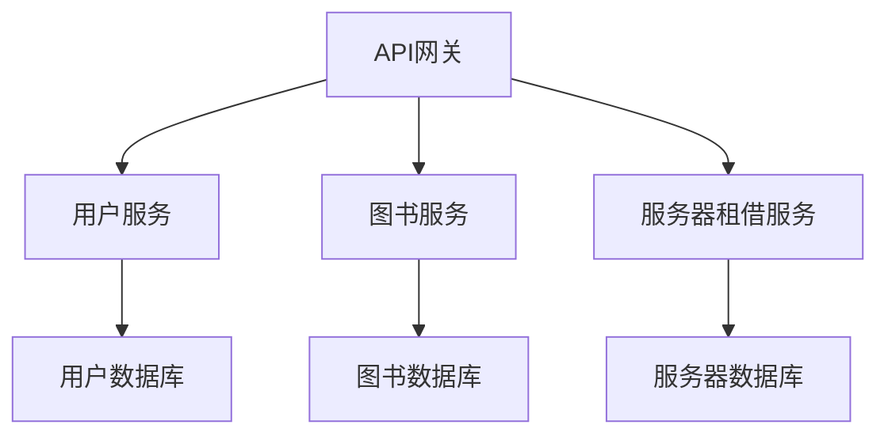
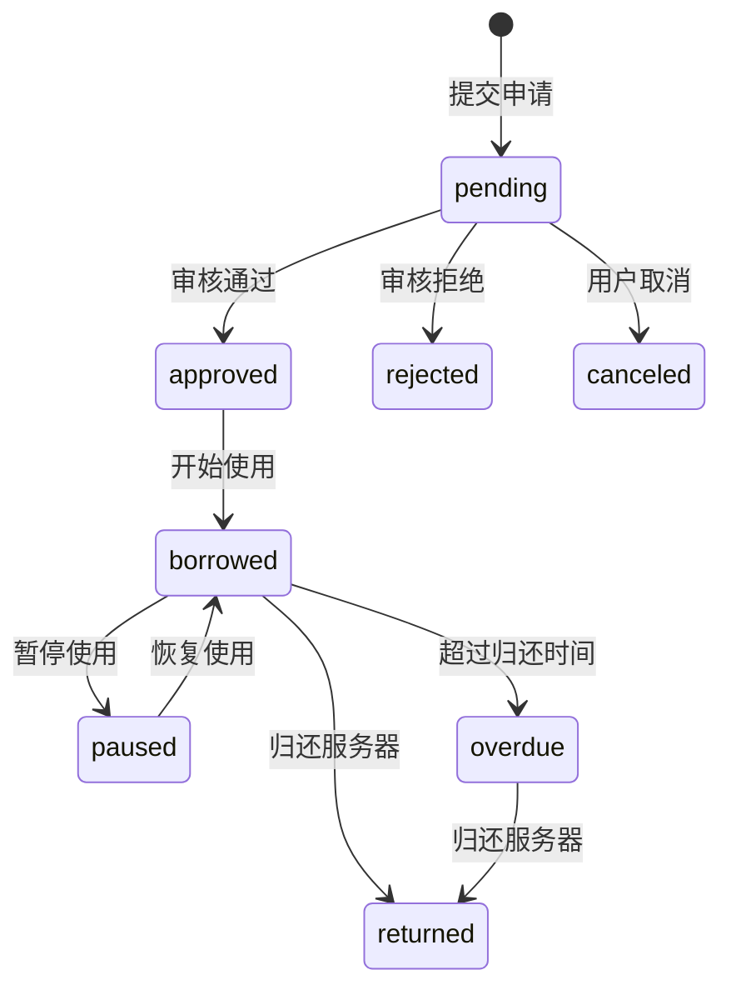

# 协作办公项目文档

本项目是一个协同工作环境，集成了图书租赁系统和服务器租赁系统。为图书资源和服务器资源提供统一的管理平台，支持学生、教师和管理员等多种用户角色。

## 项目概述
本项目为模块化设计的协作工作环境系统，包含图书管理系统和服务器租借系统两大核心模块：
- 使用Maven进行项目管理
- 模块化架构设计（common基础模块 + book-service + server-service + main-application）
- MySQL数据库双库设计（library_rental_system + server_rental_system）

## 项目结构

该项目采用Maven多模块架构，包含以下模块：

- **common**：包含项目中通用的工具类和公共功能。
- **book-service**：管理图书租赁系统，包括图书实体、仓库和业务逻辑。
- **server-service**：管理服务器租赁系统，包括服务器资源实体、仓库和业务逻辑。
- **main-application**：主应用模块，整合图书和服务器服务。

## 模块职责

### common

`common`模块包含了整个项目中可复用的工具类和公共功能，包括：

- **ConfigManager**：配置管理类，用于读取和设置配置项。
- **GlobalException**：全局异常基类，用于统一处理应用中的异常。
- **DatabaseException**：专门用于处理数据库相关异常。
- **DateUtils**：日期时间工具类，提供日期格式化、计算和比较功能。
- **IdGenerator**：唯一ID生成器，用于生成唯一的数字ID。

### book-service

`book-service`模块负责图书租赁系统的管理，包括：

- **Book**：图书实体类。
- **Category**：图书分类实体类。
- **User**：用户实体类。
- **BorrowRecord**：借阅记录实体类。
- **Notification**：通知记录实体类。

### server-service

`server-service`模块负责服务器租赁系统的管理，包括：

- **ServerResource**：服务器资源实体类。
- **ResourceCategory**：服务器资源分类实体类。
- **RentApplication**：服务器租赁申请实体类。
- **RentRecord**：服务器租赁记录实体类。
- **ResourceUsageHistory**：服务器资源使用历史记录实体类。

### main-application

`main-application`模块整合了图书和服务器服务，并提供了应用的主入口。

## 数据库设计

项目使用了两个数据库：

- **library_rental_system**：用于管理图书相关数据。
- **server_rental_system**：用于管理服务器相关数据。

数据库结构详细说明请参考`图书系统数据库说明文档.md`和`服务器系统数据库说明文档.md`。

## 开发环境配置

要设置开发环境，请按照以下步骤操作：

- Java 17
- Maven 3.8+
- MySQL 5.7.43
- 将项目克隆到本地路径。

## 开发规范
1. **数据库使用规范**
    - 仅允许查询测试数据
    - 禁止修改数据库结构
    - 缺失数据需向上反馈

2. **代码规范**
    - 所有模块使用UTF-8编码
    - JDK版本要求17
    - 实体类字段命名与数据库严格对应

3. **异常处理**
    - 使用GlobalException统一异常体系
    - 数据库操作抛出DatabaseException
    - 错误码机制（500系列）

## 注意事项
1. 数据库版本要求：MySQL 5.7.43
2. 状态字段值必须严格遵循定义：
    - 图书状态：pending, approved, borrowed, returned, overdue, rejected
    - 服务器状态：idle, in_use, maintenance, paused
3. 时间字段处理：
    - 使用LocalDateTime类型
    - 默认格式：yyyy-MM-dd HH:mm:ss
4. ID生成策略：
    - 使用IdGenerator类生成唯一ID
5. 查询性能优化：
    - Book表：idx_book_title, idx_book_category
    - BorrowRecord表：idx_borrow_status, idx_borrow_due_time
    - ServerResource表：idx_resource_status, idx_resource_cpu

## 构建与运行

要构建和运行项目，请执行以下步骤：

1. 导航到项目根目录。
2. 运行`mvn clean install`命令来构建项目。
3. 运行`main-application`模块中的`MainApplication`类来启动应用。

## 贡献

欢迎对本项目做出贡献。请遵循标准的GitHub工作流程：

1. Fork本仓库。
2. 为你的特性或Bug修复创建一个新的分支。
3. 提交你的更改。
4. 推送到你的Fork并提交Pull Request。

## 联系方式

如有任何问题或需要支持，请通过电子邮件或GitHub上的问题跟踪器联系项目维护者。