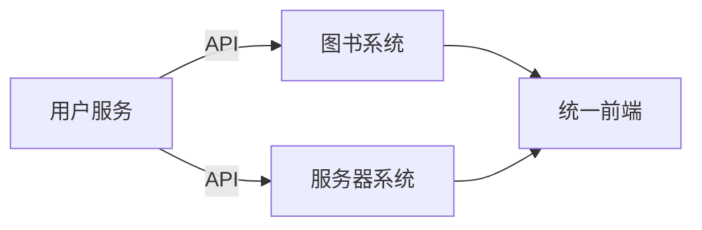
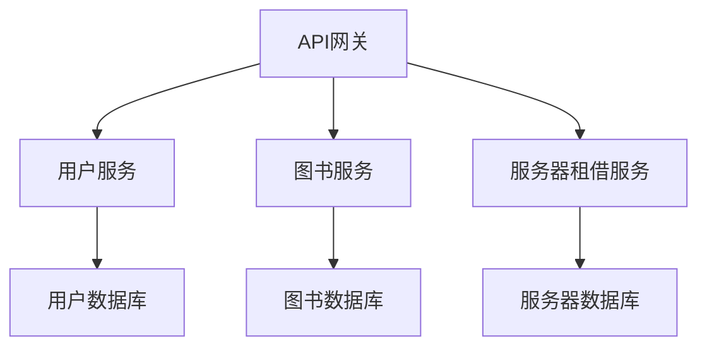

## [服务器系统说明](服务器系统数据库说明文档.md)
## 图书表 (Book)
### 存储书籍基本信息，支持搜索和分类管理
    book_id INT PRIMARY KEY AUTO_INCREMENT,  -- 图书唯一ID
    isbn VARCHAR(20) NOT NULL,             -- ISBN号
    title VARCHAR(100) NOT NULL,           -- 书名
    author VARCHAR(50) NOT NULL,           -- 作者
    publisher VARCHAR(50) NOT NULL,        -- 出版社
    publish_year YEAR,                     -- 出版年份
    category_id INT,                       -- 分类ID（外键关联Category表）
    total_count INT DEFAULT 0,             -- 馆藏总数量
    borrowed_count INT DEFAULT 0,          -- 已借出数量
    location VARCHAR(50),                  -- 馆藏位置
    call_number VARCHAR(20),               -- 索书号
    cover_image_path VARCHAR(255)          -- 封面图片路径
## 图书分类表 (Category)
### 支持按分类搜索图书
    name VARCHAR(50) NOT NULL              -- 分类名称（如文学、科技）
## 用户表 (User)
### 区分管理员、教师、学生三种角色
    username VARCHAR(50) NOT NULL UNIQUE,  -- 用户名（登录用）
    password VARCHAR(100) NOT NULL,        -- 密码
    real_name VARCHAR(50) NOT NULL,        -- 真实姓名
    role ENUM('admin', 'teacher', 'student') NOT NULL, -- 角色
    email VARCHAR(50),                     -- 联系方式（用于通知）
## 借阅记录表 (BorrowRecord)
### 核心业务流程表，记录状态流转和时间节点
    book_id INT NOT NULL,                  -- 图书ID（外键）
    user_id INT NOT NULL,                  -- 借阅人ID（外键）
    apply_time DATETIME DEFAULT CURRENT_TIMESTAMP, -- 申请时间
    audit_time DATETIME,                    -- 审核通过时间（状态变为"已通过"）
    borrow_time DATETIME,                  -- 借出时间（状态变为"已出借"）
    due_time DATETIME,                     -- 应还时间（根据规则计算）
    return_time DATETIME,                  -- 实际归还时间
    status ENUM('pending', 'approved', 'borrowed', 'returned', 'overdue', 'rejected') NOT NULL,
    auditor_id INT,                        -- 审核人ID（管理员/教师）
    reject_reason TEXT,                    -- 拒绝理由
## 通知记录表 (Notification)
### 实现逾期提醒功能
    user_id INT NOT NULL,                  -- 接收用户ID
    borrow_record_id INT NOT NULL,          -- 关联的借阅记录ID
    content TEXT NOT NULL,                 -- 通知内容
    type ENUM('due_reminder', 'overdue_alert') NOT NULL, -- 通知类型
    sent_time DATETIME DEFAULT CURRENT_TIMESTAMP, -- 发送时间
## 关键业务规则与字段说明
### 状态流转逻辑（BorrowRecord.status）：
+   待审核 (pending)：学生提交申请后的初始状态
+   已通过 (approved)：管理员/教师审核通过（未取书）
+   已出借 (borrowed)：用户取书后手动更新（学生端）或直接出借（教师/管理员端）
+   已归还 (returned)：用户手动标记归还
+   逾期 (overdue)：系统自动检测（应还时间 < 当前时间且未归还）
+   已拒绝 (rejected)：审核被拒  
### 时间字段计算：
+   应还时间 (due_time)：
+   若状态为 approved：audit_time + 30天
+   若状态为 borrowed（教师/管理员直接借出）：borrow_time + 30天
+   期天数：动态计算（CURRENT_DATE - due_time），不存储
### 权限控制：
#### 学生：只能提交申请和管理自己的借阅记录。
#### 教师/管理员：
+   直接借书（无审核流程）
+   审核学生申请
+   录入新书（Book表插入权限）
#### 通知机制：
+   到期提醒：应还时间当天发送（类型 due_reminder）
+   逾期提醒：每逾期3天发送一次（类型 overdue_alert）
+   月度统计：每月1日查询逾期记录（通过 BorrowRecord 表筛选 status='overdue'）

## 数据一致性：
+   借书时更新 Book.borrowed_count（状态变为 borrowed）
+   还书时减少 Book.borrowed_count（状态变为 returned）
## 索引优化（完善中）：
+   Book 表的 title, category_id 字段（支持搜索）
+   BorrowRecord 表的 status, due_time 字段（频繁查询状态和逾期）
## 定时任务（完善中）：
+   每日检查逾期记录并更新状态
+   每日发送到期/逾期通知
+   每月1日生成逾期报表
# 第一阶段（初始集成）

# 第二阶段（服务化拆分）

# 第三阶段（微服务架构）
