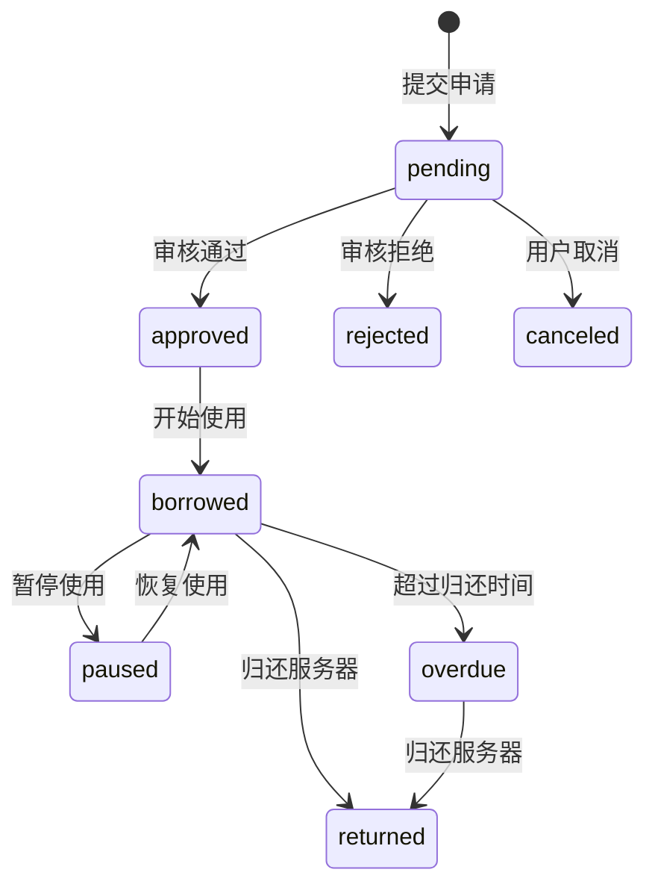
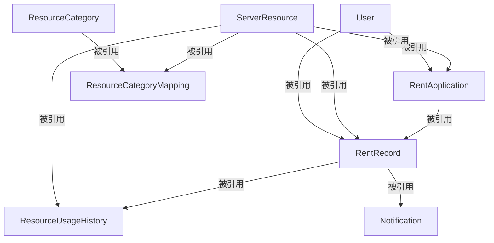

## [图书系统说明](图书系统数据库说明文档.md)
## 服务器数据库表说明
    表名	                    依赖项	                          关键操作说明
    User	                    无	                                  所有用户信息的存储
    ResourceCategory	    无	                                  服务器资源分类定义
    ServerResource	            无	                                  服务器资产核心信息
    ResourceCategoryMapping	    ServerResource, ResourceCategory  	  资源与分类的多对多关系
    RentApplication	            ServerResource, User	          租借申请记录（含审核信息）
    RentRecord	            RentApplication, User	          实际租用记录（含使用状态）
    ResourceUsageHistory	    RentRecord, ServerResource	          资源使用监控数据
    Notification	            User, RentRecord	                  通知系统（需最后修改）
## 服务器资源表（ServerResource）
    name VARCHAR(100) NOT NULL,              -- 服务器名称
    description TEXT,                        -- 描述信息
    cpu_capacity DECIMAL(5,2) NOT NULL,       -- CPU总容量（单位：核）
    memory_capacity DECIMAL(5,2) NOT NULL,    -- 内存总容量（单位：GB）
    storage_capacity DECIMAL(5,2) NOT NULL,   -- 存储总容量（单位：GB）
    location VARCHAR(100),                   -- 物理位置
## 服务器资源分类表(ResourceCategory)
    name VARCHAR(50) NOT NULL UNIQUE,         -- 分类名称
## 资源-分类关联表(ResourceCategoryMapping)

## 租借申请记录表 (RentApplication)核心业务表
    resource_id INT NOT NULL,                 -- 申请的服务器资源
    applicant_id INT NOT NULL,                -- 申请人（用户ID）
    expected_cpu DECIMAL(5,2) NOT NULL,       -- 预估CPU使用量（单位：核）
    expected_memory DECIMAL(5,2) NOT NULL,    -- 预估内存使用量（单位：GB）
    purpose TEXT,                             -- 使用目的
    apply_time DATETIME DEFAULT CURRENT_TIMESTAMP, -- 申请时间
    start_time DATETIME,                      -- 租借开始时间
    end_time DATETIME,                        -- 租借结束时间
    duration INT,                             -- 租借时长（单位：天）
    auditor_id INT,                           -- 审核人ID
    audit_time DATETIME,                      -- 审核时间
    reject_reason TEXT,                       -- 拒绝理由
## 租借记录表 (RentRecord)
    record_id INT PRIMARY KEY AUTO_INCREMENT,
    application_id INT NOT NULL,              -- 关联的申请记录
    resource_id INT NOT NULL,                 -- 租用的服务器资源
    user_id INT NOT NULL,                     -- 租用人
    start_time DATETIME NOT NULL,             -- 实际开始时间
    end_time DATETIME,                        -- 实际结束时间
    due_time DATETIME NOT NULL,               -- 应归还时间
    expected_cpu DECIMAL(5,2) NOT NULL,       -- 预估CPU使用量
    expected_memory DECIMAL(5,2) NOT NULL,    -- 预估内存使用量
    actual_cpu_usage DECIMAL(5,2),            -- 实际CPU使用量
    actual_memory_usage DECIMAL(5,2),         -- 实际内存使用量
    pause_count INT DEFAULT 0,                -- 暂停次数
## 资源使用历史表(ResourceUsageHistory)
    record_id INT NOT NULL,                   -- 关联的租借记录
    cpu_usage DECIMAL(5,2) NOT NULL,          -- CPU使用量
    memory_usage DECIMAL(5,2) NOT NULL,       -- 内存使用量
    storage_usage DECIMAL(5,2) NOT NULL,      -- 存储使用量
    recorded_time DATETIME NOT NULL,          -- 记录时间

## 状态流转说明
### 申请状态（RentApplication.status）
+ 待审核 (pending)：用户提交申请后的初始状态
+ 已通过 (approved)：管理员/教师审核通过
+ 已拒绝 (rejected)：管理员/教师拒绝申请
+ 已取消 (canceled)：用户主动取消申请
+ 租借状态（RentRecord.status）
+ 已租用 (borrowed)：用户开始使用服务器
+ 已归还 (returned)：用户归还服务器
+ 逾期 (overdue)：超过应归还时间未归还
+ 暂停使用 (paused)：用户临时暂停使用

## 核心业务规则
### 申请流程
+ 学生申请：需要审核流程（状态从pending → approved/rejected）
+ 教师申请：直接通过（状态自动变为approved）
+ 拒绝申请时必须填写拒绝理由（reject_reason字段）

## 时间计算规则
+ 应归还时间 (due_time) = 开始时间 (start_time) + 租借时长 (duration)
+ 逾期天数 = CURRENT_TIMESTAMP - due_time（动态计算）
+ 暂停时间：暂停期间不计入租借时长

## 资源监控
记录实际资源使用情况（CPU/内存/存储）
支持历史使用数据查询

